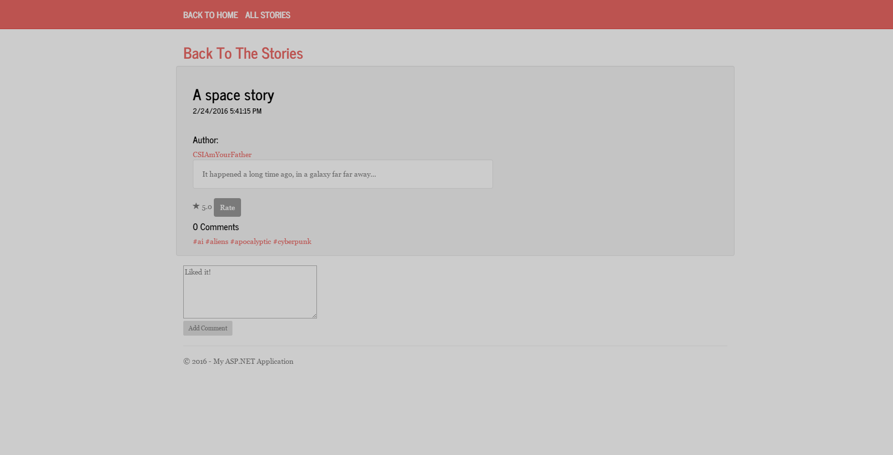

# SciHub

##Build Status

# Project Description

SciHub is an online source of material for every science fiction fan. Users can rate and comment on science fiction movies, books and tv shows, and can also read short stories posted by other users as well as rate and 
comment on those as well.

# Public Part

Visitors can see details about movies, books and tv shows and can read the short stories.

# Private Part (Users only)

Registered users can rate and comment on everything on the site, as well as be able to see user-related information on their private profile panel. 

Users can also add short stories.

# Administration Part

System administrators have access to all data and can create, read, update and delete movies, short stories, tv shows, books and other users.

Please note that the used Kendo UI for ASP.NET MVC code in this project is on trial license and could be used only if purchased or downloaded as trial from [Kendo UI for ASP.NET MVC](http://www.telerik.com/kendo-ui)

#### The project is also hosted in Azure: http://scihub.azurewebsites.net/
